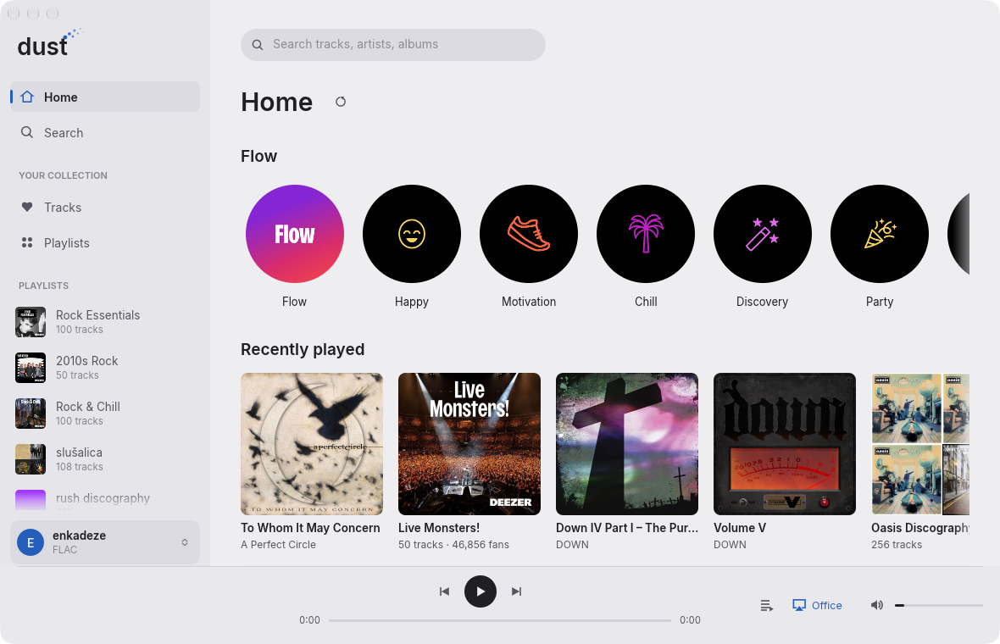

<p align="center"></p>

# dust

**A free and open source, ultra-lightweight Deezer desktop client written in Rust — with
AirPlay 2 streaming built in.**

[](https://github.com/domknez/dust/actions/workflows/ci.yml)
[](LICENSE)


<picture>
  <source media="(prefers-color-scheme: dark)" srcset="assets/screenshots/home-dark.png">
  
</picture>

dust is free software: free to use, study, modify and share under the [MIT license](LICENSE).
No ads, no telemetry, no account with us — just your Deezer subscription.
Inspired by [SpotLight](https://github.com/dddevid/SpotLight).

| | dust | Deezer desktop |
|---|---|---|
| Binary | ~8 MB | 300+ MB |
| Memory, idle in background | ~85 MB | 400+ MB |
| Memory, idle and visible | ~155 MB¹ | |
| Idle CPU | ~0% (UI sleeps when untouched) | |

¹ About half of that is the window's own drawing buffers, which macOS keeps for every
visible window (they scale with window size on Retina displays); dust itself uses ~70–85 MB,
including cover art.

## Features

- **Home like Deezer's:** your personalised recommendations — Flow and its moods
  (Chill, Focus, Workout, Party, ...), daily mixes, recently played, new releases,
  artists and albums picked for you
- **Endless Flow:** keeps going like on Deezer, fetching more as you listen
- **Music:** Loved tracks, playlists (list and grid), your albums, the artists you follow
- **Likes:** heart tracks (in any list or the player bar) and albums, follow artists;
  synced with your Deezer account
- **Artist pages:** popular tracks and the full discography (albums, singles & EPs,
  live & compilations), playlists featuring them and related artists; click any
  artist name to get there
- **Search:** tracks, artists, albums and playlists, with your own playlists first; or
  paste a Deezer link (album, artist, playlist, track, or a share link) to open it
- **Plays more of the catalogue:** when a track isn't licensed in your region, dust uses
  the alternative version Deezer offers, like the web app does
- **Quality:** MP3 128 / MP3 320 / FLAC (FLAC needs a HiFi plan), streamed and decoded
  on the fly — nothing is written to disk
- **Queue:** see what's next, jump to any track, reorder by dragging, remove, clear;
  it survives a restart (paused where you left off);
  right-click any track or card → *Play next* / *Add to queue*
- **Seeking** (HTTP range jumps for MP3), shuffle
- **AirPlay 2 and AirPlay 1** output with automatic discovery — Sonos (incl. Era 100/300),
  HomePod-class receivers, Apple TV, AirPort Express, shairport-sync and most AirPlay speakers
- **Last.fm scrobbling, history and Flow learning:** dust reports what you listen to
  back to Deezer, exactly like Deezer's own apps
- **Speaker buttons work:** volume and play/pause/skip on the speaker control dust
- **Mini player**: a small always-on-top strip with cover, controls
  and seek bar; drag it anywhere, double-click the cover to go back
- **Updates itself**: new versions download and verify in the
  background; then *Restart to update* appears in the sidebar (or the update installs
  when you quit)
- **Media keys and Now Playing:** keyboard and headset media keys, plus the system's
  Now Playing controls with cover art (macOS Control Center, Windows media overlay,
  Linux MPRIS)
- **Modern UI:** Tidal-style layout with cover art, soft dark and light themes (or follow
  the system), Inter typeface
- **Secure sign-in:** "Log in with Deezer" opens Deezer's own login page; the session is
  kept in the OS keychain (macOS Keychain, Windows Credential Manager, Secret Service)
- Runs on macOS, Linux and Windows

## Install

Download the latest version for your platform from
[Releases](https://github.com/domknez/dust/releases/latest): a DMG for macOS 11+ (Apple
Silicon and Intel), a zip for Windows 10/11, and tarballs for Linux x86_64 and ARM64.
Deezer Premium required.

- **macOS:** drag dust to Applications. Releases aren't notarized by Apple yet, so the
  first launch is blocked: open dust once, then click **Open Anyway** under System
  Settings → Privacy & Security. After an update macOS may ask once more before dust can
  read its saved login; choose **Always Allow**.
- **Windows:** unzip and run `dust.exe`; on a SmartScreen warning choose
  **More info → Run anyway**.
- **Linux:** unpack and run `./dust` (needs WebKitGTK 4.1, ALSA and D-Bus; the archive
  includes a `.desktop` entry and icon).

Later versions install themselves from inside dust. On Windows and
Linux that needs dust's folder to be writable by you (e.g. `~/.local/bin`); otherwise
the update button opens the download page.

## Build

```sh
cargo build --release
./target/release/dust
```

On macOS, run `scripts/dev-cert.sh` once and build with `scripts/build.sh`: it signs
builds with a local "dust dev" identity so Keychain stops asking for access after every
rebuild. `scripts/bundle-macos.sh` builds the universal `dust.app` and DMG into `dist/`.

Releases:

- **Merging a pull request into `main` releases it.** The Auto release workflow bumps
  the minor version, moves the CHANGELOG's *Unreleased* notes under it (or uses the PR
  title), commits, and tags; the tag starts the Release workflow. PR labels:
  `release:patch`, `release:major`, or `no-release` to merge without releasing.
- **Direct pushes to `main` don't release.** To release by hand:
  `scripts/bump-version.py minor` (or `patch`, `major`, `0.5.0`), commit, then
  `git tag v<version> && git push origin main v<version>`.

The Release workflow builds every platform and publishes the GitHub Release. Adding the
Apple secrets listed in `.github/workflows/release.yml` makes it sign with a Developer ID
and notarize.

Linux needs ALSA, D-Bus and WebKitGTK headers:
`sudo apt install libasound2-dev libdbus-1-dev libwebkit2gtk-4.1-dev pkg-config`.
Without the login window (no WebKitGTK): `cargo build --release --no-default-features`.

## Log in

Click **Log in with Deezer**: a small window shows deezer.com's own login page (OS
webview, private session). Once you are signed in, dust picks up the session and closes
it. The session token (`arl` cookie) is stored in your OS keychain; **Log out** in the
account menu removes it. Deezer Premium required. Email/password sign-in works; Google
and Apple sign-in may refuse embedded browsers.

Fallback: "Paste ARL cookie instead" takes the `arl` value from a logged-in browser
(DevTools → Application → Cookies). Treat it like a password; "Log out of all devices"
in Deezer's account settings revokes it.

## Settings

Click your name at the bottom of the sidebar:

- **Appearance:** System, Dark or Light
- **Streaming quality:** MP3 128, MP3 320 or FLAC
- **Share listening with Deezer:** history, Flow and Last.fm scrobbling (on by default)
- **Updates**: check automatically (on by default), or check now

dust also remembers your **volume** and your **speaker**: the last AirPlay speaker you
picked is selected again automatically once it appears on the network (it only connects
when you press play).

The update check asks GitHub's public releases API for the latest version at startup
and every 6 hours; nothing about you or your listening is sent. Turn it off with
**Check automatically** and dust contacts only Deezer and your speakers.

Choices are saved in `settings.conf` in your config directory
(`~/Library/Application Support/dust` on macOS, `%APPDATA%\dust` on Windows,
`~/.config/dust` on Linux).
The queue is saved next to it, in `queue.json`, and comes back paused when dust starts.

## Last.fm scrobbling and listening history

dust reports each listen to Deezer (how long you listened, whether you skipped), the same
way Deezer's apps do. Deezer uses that for your listening history, "Recently played" and
Flow recommendations and, if you've connected Last.fm in your Deezer account settings,
scrobbles it to Last.fm. Nothing is sent anywhere else.

Turn it off under **Share listening with Deezer** in the account menu.

## AirPlay

Pick a speaker from the AirPlay button next to the volume slider. Expect about 2 s of
latency, the same as other AirPlay senders.

- **AirPlay 2** receivers (most speakers from recent years, e.g. Sonos Era): dust pairs
  transiently (HomeKit, no PIN), encrypts control and audio, and runs a small PTP clock
  that the speaker follows. PTP uses UDP ports 319/320: fine without root on macOS and
  Windows; on Linux grant `CAP_NET_BIND_SERVICE`
  (`sudo setcap cap_net_bind_service=+ep target/release/dust`), otherwise dust falls back
  to NTP timing, which many AirPlay 2 speakers accept but won't play.
- **AirPlay 1** receivers with unencrypted audio (`et=0`) use the classic RAOP path.
- Not supported yet: receivers that need an AirPlay password or PIN pairing.

Speaker hardware buttons reach dust through DACP (an mDNS-advertised remote-control
service), so volume changes on the speaker move dust's slider.

Check an output without logging in:

```sh
dust --list-speakers                       # speakers found on the network (silent)
dust --check-update                        # is a newer release out, can this copy install it
dust --tone                                # 4 s test tone on the local sound card
DUST_LOG=debug dust --tone "Living Room"   # ...on an AirPlay speaker, with packet stats
```

## Troubleshooting

`DUST_LOG=debug` (or `info`, `trace`) prints diagnostics to the terminal, e.g. AirPlay
packet stats, speaker remote-control requests, media keys and listen reports.

With a stored session (log in with the app first), these check the Deezer side without
opening the window:

```sh
dust --debug-home                          # home page sections
dust --debug-search "daft punk"            # search results
dust --debug-link <deezer url>             # what a pasted link opens
dust --debug-decode <playlist id> flac 60  # decrypt and decode 10 s from 0:60, silently
```

## Shortcuts

- `Space`: play/pause
- `⌘F` / `Ctrl+F`: search
- `⌘⇧M` / `Ctrl+Shift+M`: mini player on/off
- Double-click a track, or click its number: play from there
- Home cards: click to open, click the round play button to play right away
- Right-click a track or card: *Play next* / *Add to queue*
- Queue button (next to AirPlay): open the queue; drag rows to reorder

## Project structure

```
src/
├── main.rs            entry point: run the app, or a command-line mode (cli.rs)
├── log.rs             DUST_LOG levels and log macros
├── deezer/            Deezer client: session, catalogue, streaming, listen reports, stream cipher
├── player/            playback engine thread, queue (pure, tested), decoding, listen tracking
├── output/            audio outputs behind the Sink trait
│   ├── local.rs       sound card (cpal)
│   └── airplay/       AirPlay 1 & 2 sender: discovery, RTSP, handshakes, packets, network threads,
│                      ap2/ (pairing, plists, PTP clock), dacp (speaker remote control)
├── ui/
│   ├── app.rs         UI state, lifecycle and panel layout
│   ├── now_playing.rs media keys and the OS Now Playing widget
│   ├── views/         one file per screen or panel
│   ├── widgets/       reusable painted components
│   └── style/         palette, type scale, metrics, icons — all visual constants live here
├── credentials.rs     session in the OS keychain
├── settings.rs        settings file
├── update.rs          self-update from GitHub Releases
└── login.rs           "Log in with Deezer" webview helper
```

To change how dust looks, start in `src/ui/style/`: views use named text roles
(`typography::TITLE`, `CAPTION`, ...), palette colours and `metrics` constants rather than
raw values. `cargo test` covers the protocol and data layers and the playback engine
(against fake outputs); the commands under [Troubleshooting](#troubleshooting) check real
audio output and the Deezer API.

## Credits

- AirPlay 2 pairing, encryption and PTP timing follow the approach of
  [OwnTone](https://github.com/owntone/owntone-server) (its PTP library, libairptp, is MIT)
  and were validated against [shairport-sync](https://github.com/mikebrady/shairport-sync).
- [Inter](https://rsms.me/inter/) typeface by Rasmus Andersson, SIL Open Font License
  ([assets/fonts/OFL-Inter.txt](assets/fonts/OFL-Inter.txt)).
- Built with [egui](https://github.com/emilk/egui), [symphonia](https://github.com/pdeljanov/Symphonia),
  [cpal](https://github.com/RustAudio/cpal), [souvlaki](https://github.com/Sinono3/souvlaki)
  and [wry](https://github.com/tauri-apps/wry).

## License

dust is free and open source software, released under the [MIT license](LICENSE).
Contributions are welcome.

## Disclaimer

dust is an unofficial client and is not affiliated with or endorsed by Deezer. It uses
Deezer's private web API with your own subscription, for personal use; it may break at
any time or conflict with Deezer's terms of service.
